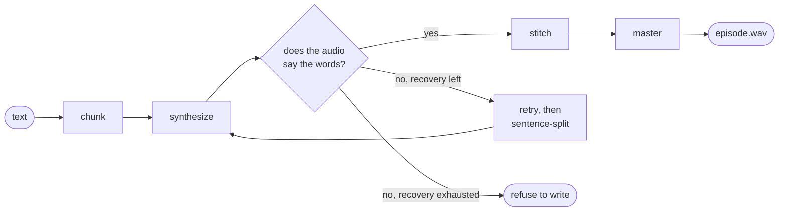

# narrator

Long-form narration from text. Chunk, synthesize, **verify**, stitch, master.

Built for episodes and audiobooks — twenty to forty minutes of speech assembled
from ~100 independently generated chunks, where the hard problem is not making
audio but knowing whether the audio says what you asked for.

> **Status: v0.1, early.** Requires Python 3.12+; the bundled TTS/ASR stack
> runs on Apple-Silicon Macs only (Higgs alone is ~8.7 GB on disk and ~12 GB
> peak RAM; recogniser weights download on first use).

## Quickstart

Prepare a short reference WAV of the narrator's voice and its exact transcript;
the examples assume both are in the current directory.

```bash
pip install "narrator[higgs,parakeet] @ git+https://github.com/pistelak/narrator"

narrate chapter.txt episode.wav --voice voice.wav --voice-text "transcript of the clip"
afplay episode.wav
```

Library — the input vocabulary is just `Text` and `Gap`:

```python
from pathlib import Path
from narrator import Text, Gap, Voice, render
from narrator.backends.higgs import HiggsBackend

report = render(
    [Text("On the northern coast stands a lighthouse no ship will ever pass."),
     Gap(3.0),
     Text("Not the keeper. Not a stranger.")],
    voice=Voice(Path("voice.wav"), "transcript of the clip"),
    backend=HiggsBackend(),
    out=Path("episode.wav"),
)
print(report.summary())
```

Verification is on by default and needs no setup: narrator picks its own
recogniser stack, matched to the engine's sample rate.

### Dialogue

A `Text` may pin its own `voice`, overriding the render's default for that
segment. Narrator still learns no markup: a caller resolves its own speaker
convention into per-segment voices.

```python
narrator = Voice(Path("voice.wav"), "transcript of the clip")
questioner = Voice(Path("questioner.wav"), "transcript of the other clip")

render(
    [Text("Why would anyone burn money on purpose?", voice=questioner),
     Text("Nobody burns it on purpose. The typo does.")],
    voice=narrator, backend=HiggsBackend(), out=Path("episode.wav"),
)
```

Chunking never crosses a segment, so a voice cannot bleed into another
speaker's turn.

Two voices can arrive at different levels, and mastering cannot repair it —
loudness normalisation moves both speakers by the same amount, so the file gets
no closer to balanced. `Voice.gain_db` is where you state the correction:

```python
questioner = Voice(Path("questioner.wav"), "transcript of the clip", gain_db=-4.0)
```

It is one constant gain applied to every chunk that voice speaks, so a whisper
stays a whisper — only the speaker moves, never the performance.

**Getting the number.** Render every voice speaking a few ordinary, comparable
lines in **one** file with no gains set, then compare their levels and turn the
louder ones down by the difference. It has to be one file: each render is
mastered to the same loudness target on its own, so two separately rendered
files are normalised to the same level by construction and the imbalance you
are trying to measure is gone before you can look at it.

If your voices are cloned from reference clips, loudness-normalising those clips
first (`ffmpeg -af loudnorm`, two-pass linear) is reasonable hygiene and may be
all you need — R128 gates out pauses and room tone properly, which is the part
that is hard to do by hand. It is not a guaranteed substitute: matched reference
loudness need not mean matched output, and preset voices have no clip to
normalise at all. Calibrate as above either way.

Narrator will not work the number out for you, and that is deliberate. Three
designs that inferred it from the rendered audio were built and measured, and
each confused a quiet *delivery* with a quiet *reference* — boosting a
deliberate whisper, or turning a whole narrator down because another speaker's
one aside was hushed. Measuring the reference clips instead fails one level
deeper: telling a voice from the room it was recorded in needs voice-activity
detection, and a threshold that is not one reads two seconds of room tone as
3 dB of level difference. Use a level meter or a calibration render, or
normalise the clips before you pass them in; narrator applies exactly what you
declare and never invents a level.

### Casting: match the reference's register to the script's

A reference clip is **behavioural conditioning, not merely a timbre sample**.
Pinning it holds identity and stops drift — that is why it exists — but a
cloning engine conditions on the whole clip, so it also carries how that person
talks: which words they reach for, not only how they sound.

Cast a reference in a different register from the script and the model can
follow the voice rather than the page. Measured on one Czech cast: a clip of
colloquial speech rendered `jen` ("only") as `jenom` on 10 of 10 attempts, where
the standard-Czech reference passed the same paragraph on the first attempt.
Both recognisers agreed on both clips — strong evidence the substitution was in
the audio and not the transcription ([#9]). Under a word-for-word contract that
audio genuinely does not match, so by default the retries are exhausted and the
render is quarantined, correctly.

Per-word equivalences are the wrong repair for this. `sound_alikes` exists, and
earns its place for pronunciation pairs — but a register is an open-ended set of
such preferences, and each entry widens the gate a little. Either recast in the
script's register, or write the script in the reference's. Verification
therefore doubles as a **casting-compatibility check**: a reference that
systematically rewrites script content is not usable with a literal script, and
a render will normally surface that on the first attempt.

[#9]: https://github.com/pistelak/narrator/issues/9

## How it works

Every chunk is transcribed back by a speech recogniser and scored against the
text it was supposed to say. A chunk that fails is retried, then split into
sentences and rendered one by one. If a chunk still fails, narrator by default
**does not write the output file at all** — you get a report naming the chunk
and what went wrong, instead of a plausible file nobody knows is broken.



## Why this exists

In the engines measured for this project, paragraph-sized prompts sometimes
truncate, repeat, or degenerate — **silently**, producing a plausible waveform
of plausible length containing the wrong words.

The pipeline this was extracted from shipped a twenty-minute episode with seven
dropped sentences, including a question that left a pause and an answer with
nothing between them. Every chunk passed duration validation. That is the
failure class this library is designed to detect before a file is written.

## What "verified" means

The recogniser never sees the script, so a transcript that matches it is real
evidence about the audio. Each chunk is scored **per sentence** against a 0.90
coverage threshold — a dropped sentence scores near zero no matter how good the
rest sounds, where an aggregate score would let it hide. Some discrepancies
force a rejection outright:

- an isolated **number** that changed value ("four bytes" became "nine bytes")
- a **negation or meaning-critical word** (from a fixed English/Czech list)
  that appeared or vanished
- a sentence the round-trip **cannot check at all** — that fails closed,
  not open

Inserted content is caught by a precision term against the same threshold, and
spelling-only disagreements (digits vs. spelled-out numbers, phonetic variants
in Czech) are folded away before scoring, so the verifier argues about sound,
not orthography. The rules and thresholds live in `narrator/verify.py`, each
with the measured failure that motivated it.

With the `[parakeet]` extra installed, two recognisers with different
architectures share the job: Parakeet checks every chunk, and Whisper reviews
only its rejections. A chunk passes if either recogniser independently confirms
the script and fails only if neither can — one model's misreading of correct
audio doesn't cost an expensive re-synthesis. Without the extra, Whisper runs
alone.

Verification is on by default; opting out is always explicit (`--no-verify`,
or `NullVerifier()`), never a silent fallback.

## Reusing takes (opt-in)

Point a render at a directory of takes and it stops re-doing work it has
already done:

```bash
narrate script.txt episode.wav --voice v.wav --voice-text "..." --takes .takes
```

```python
render(segments, voice, backend, out, cfg=RenderConfig(takes=Path(".takes")))
```

Each verified chunk is filed under a digest of everything that produced it. So
changing one word in a script re-synthesises the chunk that changed and reuses
the rest; a killed run resumes from what it finished; and a render that
**refuses to write** — the default when a chunk cannot be verified — keeps the
chunks that passed, so fixing the offending line costs one chunk instead of an
episode. Tuning `Voice.gain_db` costs nothing at all: level is applied after
synthesis, so it is deliberately not part of the key.

A reused chunk is reported as reused, in the progress line and the summary,
because it carries the verdict it was stored with rather than one measured just
now. Everything that could make a stored take the wrong answer invalidates it:
the text, the pronunciation lexicon, the voice — down to the *bytes* of the
reference clip, since a same-size replacement would otherwise ship the previous
speaker under a clean report — the engine, the recogniser, their package
versions, and narrator's own synthesis and verification semantics. A backend or
verifier that does not declare an identity disables reuse entirely rather than
being guessed at.

Two things it will not do. It never returns a *different* take of the same
text, so audio that verifies but does not sound right needs `--reroll 12,40`
(or `RenderConfig(reroll=...)`) to force a fresh generation. And an edit that
changes how a paragraph packs into chunks invalidates that paragraph's chunks
from the edit onward — boundaries are not content-defined.

## Question intonation (opt-in)

The measured engines render yes/no question rises stochastically — roughly 3
verified takes in 5 rise; the rest come out flat (`bench/RESULTS.md` §11).
When the caller marks a chunk as rise-wanting, the retry ladder keeps
generating past a verified-but-flat take until one also rises, within the
same attempt budget; if none does, the first verified take ships. Prosody is
a preference, never a gate: it cannot rescue an unverified take and cannot
fail a verified chunk.

```python
from narrator import SynthConfig, yes_no_question

cfg = RenderConfig(synth=SynthConfig(wants_rise=yes_no_question))
```

Intent must come from the caller because punctuation cannot supply it:
wh-questions end in `?` too and correctly go **down**. `yes_no_question` is
the offered policy (`?`-final, no wh-word, English/Czech); callers with real
script knowledge pass their own `(text, lang) -> bool`. Off by default —
like `spell_acronyms`, it changes how the narration sounds. Requires librosa
(the `[higgs]` extra); without it the preference is silently inert. Measured
effect on the reference cast: 59% → 74–85% of yes/no questions rising, extra
generations only on question chunks that verify flat.

## Design

- **The caller owns markup.** Narrator's input is `Text` and `Gap` segments and
  nothing else. It never learns what a `[PAUSE]` marker or an SSML tag is.
- **The engine is behind a `Backend` protocol.** Chunking, verification and
  retry are engine-independent, so swapping engines does not mean re-earning
  them. Two engines ship (Higgs Audio v3 for quality, Supertonic for fast
  drafts) plus a deterministic fake that reproduces real failure modes for
  tests.
- **Duration checks are not verification.** They caught zero of eight real
  content drops in the measurements that motivated this library.

## Requirements

The backend-independent core (chunking, verification scoring, assembly,
mastering) supports Python 3.12+ wherever its scientific-audio dependencies
(NumPy, SciPy, SoundFile, pyloudnorm) are available — CI runs it on Linux and
macOS. The bundled engines and recognisers are **Apple-Silicon only**: the
`[higgs]` extra (Higgs Audio v3 + mlx-whisper) and the `[parakeet]` extra both
build on MLX. On other hardware, implement the small `Backend`/`ASR` protocols
against your engine of choice — that seam is the point of the library.

## License

MIT.
