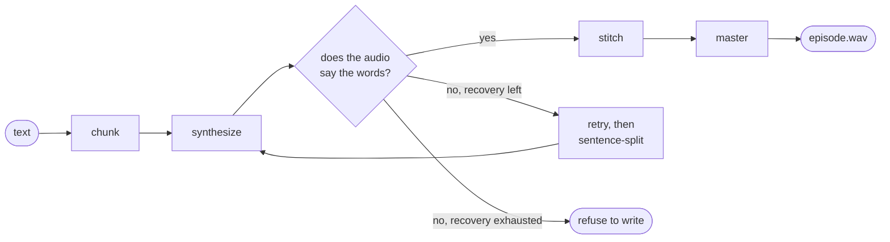

# narrator

Long-form narration from text. Chunk, synthesize, **verify**, stitch, master.

Built for episodes and audiobooks — twenty to forty minutes of speech assembled
from ~100 independently generated chunks, where the hard problem is not making
audio but knowing whether the audio says what you asked for.

> **Status: v0.1, early.** Requires Python 3.12+; the bundled TTS/ASR stack
> runs on Apple-Silicon Macs only (Higgs alone is ~8.7 GB on disk and ~12 GB
> peak RAM; recogniser weights download on first use).

## Quickstart

Prepare a short reference WAV of the narrator's voice and its exact transcript;
the examples assume both are in the current directory.

```bash
pip install "narrator[higgs,parakeet] @ git+https://github.com/pistelak/narrator"

narrate chapter.txt episode.wav --voice voice.wav --voice-text "transcript of the clip"
afplay episode.wav
```

Library — the input vocabulary is just `Text` and `Gap`:

```python
from pathlib import Path
from narrator import Text, Gap, Voice, render
from narrator.backends.higgs import HiggsBackend

report = render(
    [Text("On the northern coast stands a lighthouse no ship will ever pass."),
     Gap(3.0),
     Text("Not the keeper. Not a stranger.")],
    voice=Voice(Path("voice.wav"), "transcript of the clip"),
    backend=HiggsBackend(),
    out=Path("episode.wav"),
)
print(report.summary())
```

Verification is on by default and needs no setup: narrator picks its own
recogniser stack, matched to the engine's sample rate.

## How it works

Every chunk is transcribed back by a speech recogniser and scored against the
text it was supposed to say. A chunk that fails is retried, then split into
sentences and rendered one by one. If a chunk still fails, narrator by default
**does not write the output file at all** — you get a report naming the chunk
and what went wrong, instead of a plausible file nobody knows is broken.



## Why this exists

In the engines measured for this project, paragraph-sized prompts sometimes
truncate, repeat, or degenerate — **silently**, producing a plausible waveform
of plausible length containing the wrong words.

The pipeline this was extracted from shipped a twenty-minute episode with seven
dropped sentences, including a question that left a pause and an answer with
nothing between them. Every chunk passed duration validation. That is the
failure class this library is designed to detect before a file is written.

## What "verified" means

The recogniser never sees the script, so a transcript that matches it is real
evidence about the audio. Each chunk is scored **per sentence** against a 0.90
coverage threshold — a dropped sentence scores near zero no matter how good the
rest sounds, where an aggregate score would let it hide. Some discrepancies
force a rejection outright:

- an isolated **number** that changed value ("four bytes" became "nine bytes")
- a **negation or meaning-critical word** (from a fixed English/Czech list)
  that appeared or vanished
- a sentence the round-trip **cannot check at all** — that fails closed,
  not open

Inserted content is caught by a precision term against the same threshold, and
spelling-only disagreements (digits vs. spelled-out numbers, phonetic variants
in Czech) are folded away before scoring, so the verifier argues about sound,
not orthography. The rules and thresholds live in `narrator/verify.py`, each
with the measured failure that motivated it.

With the `[parakeet]` extra installed, two recognisers with different
architectures share the job: Parakeet checks every chunk, and Whisper reviews
only its rejections. A chunk passes if either recogniser independently confirms
the script and fails only if neither can — one model's misreading of correct
audio doesn't cost an expensive re-synthesis. Without the extra, Whisper runs
alone.

Verification is on by default; opting out is always explicit (`--no-verify`,
or `NullVerifier()`), never a silent fallback.

## Design

- **The caller owns markup.** Narrator's input is `Text` and `Gap` segments and
  nothing else. It never learns what a `[PAUSE]` marker or an SSML tag is.
- **The engine is behind a `Backend` protocol.** Chunking, verification and
  retry are engine-independent, so swapping engines does not mean re-earning
  them. Two engines ship (Higgs Audio v3 for quality, Supertonic for fast
  drafts) plus a deterministic fake that reproduces real failure modes for
  tests.
- **Duration checks are not verification.** They caught zero of eight real
  content drops in the measurements that motivated this library.

## Requirements

The backend-independent core (chunking, verification scoring, assembly,
mastering) supports Python 3.12+ wherever its scientific-audio dependencies
(NumPy, SciPy, SoundFile, pyloudnorm) are available — CI runs it on Linux and
macOS. The bundled engines and recognisers are **Apple-Silicon only**: the
`[higgs]` extra (Higgs Audio v3 + mlx-whisper) and the `[parakeet]` extra both
build on MLX. On other hardware, implement the small `Backend`/`ASR` protocols
against your engine of choice — that seam is the point of the library.

## Status

Early. Extracted from a working pipeline; being rebuilt with the tests that
pipeline never had. The design decisions are documented in the code where they
apply, each with the measurement that motivated it.

## License

MIT.
