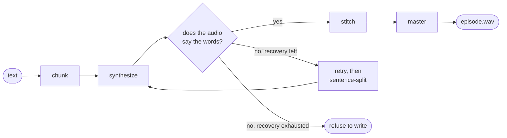

# narrator

Long-form narration from text. Chunk, synthesize, **verify**, stitch, master.

Built for episodes and audiobooks — twenty to forty minutes of speech assembled
from ~100 independently generated chunks, where the hard problem is not making
audio but knowing whether the audio says what you asked for.

> **Status: v0.1, early.** Requires Python 3.12+. The default engine (Higgs
> Audio v3) and both bundled recognisers run on Apple-Silicon Macs only (Higgs
> alone is ~8.7 GB on disk and ~12 GB peak RAM; recogniser weights download on
> first use). See [Requirements](#requirements).

## Quickstart

Prepare a short reference WAV of the narrator's voice and its exact transcript;
the examples assume both are in the current directory.

```bash
pip install "narrator[higgs,parakeet] @ git+https://github.com/pistelak/narrator"

# Free, no model: will any chunk be refused whatever the audio says?
narrate chapter.txt episode.wav --preflight --lang cs

narrate chapter.txt episode.wav --lang cs --voice voice.wav --voice-text "transcript of the clip"
afplay episode.wav
```

`--lang` names the script's language and defaults to `en`; it decides how
numbers are read and how the transcript is compared, so set it for anything
else. Blank lines in the text file are paragraph breaks. `narrate --help` lists
the rest.

Library — the input vocabulary is just `Text` and `Gap`:

```python
from pathlib import Path
from narrator import Text, Gap, Voice, render
from narrator.backends.higgs import HiggsBackend

report = render(
    [Text("On the northern coast stands a lighthouse no ship will ever pass."),
     Gap(3.0),
     Text("Not the keeper. Not a stranger.")],
    voice=Voice(Path("voice.wav"), "transcript of the clip"),  # lang="en" by default
    backend=HiggsBackend(),
    out=Path("episode.wav"),
)
print(report.summary())
```

Verification is on by default and needs no setup: narrator picks its own
recogniser stack, matched to the engine's sample rate.

### When a render is refused

If any chunk still fails after its retries, **no file is written**. The CLI
prints each failing chunk — its number, coverage, the sentence that went
missing — and exits 1; the library raises `RenderFailed`, whose `.report` is
the full `RenderReport` (`.clean`, `.failures`, one `ChunkResult` per chunk).

| `narrate` exit | Meaning |
|---|---|
| 0 | written, every chunk verified (unchecked under `--no-verify`); or `--preflight` found nothing doomed |
| 1 | refused; or written under `--write-anyway` with failures; or `--preflight` found a doomed chunk |
| 2 | bad input or options (unknown `--reroll` number, empty script, …) |

`--write-anyway` (library: `RenderConfig(quarantine=False)`) writes the file
regardless and still reports what failed. Usually the better fix is the line
itself: see [Pronunciation](#pronunciation-acronyms-and-control-tags) and
[Casting](#casting-match-the-references-register-to-the-scripts), and pair it
with [`--takes`](#reusing-takes-opt-in) so re-running pays only for the chunk
you changed.

`--preflight` (library: `narrator.preflight(segments, lang=...)`) runs the
verifier against each chunk's own text, with no model. The guarantee runs one
way: a chunk it flags **will** be refused — an all-numeral sentence like "Two
fifty six." is the usual one — but a clean preflight does not promise a clean
render.

## How it works

Every chunk is transcribed back by a speech recogniser and scored against the
text it was supposed to say. A chunk that fails is retried, then split into
sentences and rendered one by one. If a chunk still fails, narrator by default
**does not write the output file at all** — you get a report naming the chunk
and what went wrong, instead of a plausible file nobody knows is broken.


```mermaid
flowchart LR
    T([text]) --> C[chunk] --> S[synthesize] --> V{does the audio<br/>say the words?}
    V -- yes --> ST[stitch] --> M[master] --> W([episode.wav])
    V -- "no, recovery left" --> R[retry, then<br/>sentence-split] --> S
    V -- "no, recovery exhausted" --> F([refuse to write])
```

## Common tasks

### Dialogue

A `Text` may pin its own `voice`, overriding the render's default for that
segment. Narrator still learns no markup: a caller resolves its own speaker
convention into per-segment voices.

```python
narrator = Voice(Path("voice.wav"), "transcript of the clip")
questioner = Voice(Path("questioner.wav"), "transcript of the other clip")

render(
    [Text("Why would anyone burn money on purpose?", voice=questioner),
     Text("Nobody burns it on purpose. The typo does.")],
    voice=narrator, backend=HiggsBackend(), out=Path("episode.wav"),
)
```

Chunking never crosses a segment, so a voice cannot bleed into another
speaker's turn.

Two voices can arrive at different levels, and mastering cannot repair it —
loudness normalisation moves both speakers by the same amount, so the file gets
no closer to balanced. `Voice.gain_db` is where you state the correction:

```python
questioner = Voice(Path("questioner.wav"), "transcript of the clip", gain_db=-4.0)
```

It is one constant gain applied to every chunk that voice speaks, so a whisper
stays a whisper — only the speaker moves, never the performance.

**Getting the number.** Render every voice speaking a few ordinary, comparable
lines in **one** file with no gains set, then compare their levels and turn the
louder ones down by the difference. It has to be one file: each render is
mastered to the same loudness target on its own, so two separately rendered
files are normalised to the same level by construction and the imbalance you
are trying to measure is gone before you can look at it.

If your voices are cloned from reference clips, loudness-normalising those clips
first (`ffmpeg -af loudnorm`, two-pass linear) is reasonable hygiene and may be
all you need — R128 gates out pauses and room tone properly, which is the part
that is hard to do by hand. It is not a guaranteed substitute: matched reference
loudness need not mean matched output, and preset voices have no clip to
normalise at all. Calibrate as above either way. Narrator will not work the
number out for you — [why](#why-level-is-declared-not-inferred).

### Pronunciation, acronyms and control tags

Three `SynthConfig` settings, passed as `RenderConfig(synth=SynthConfig(...))`
(library only):

```python
from narrator import RenderConfig, SynthConfig

cfg = RenderConfig(synth=SynthConfig(
    pronunciation=(("Kalle", "Kalleh"),),  # written form -> what the engine is sent
    spell_acronyms=True,                    # read all-caps tokens as letter names
    non_speech=("<|emotion:surprise|>",),   # exact spans that are not speech
))
```

- **`pronunciation`** is applied only at synthesis; verification always
  compares against your original text, because the recogniser hears "Kalle",
  not "Kalleh". The default verifier also treats each pair as a sound-alike, so
  a transcript containing the spoken form still matches — but only when both
  sides are single words: a pair may say one word is heard as another, never
  that part of the audio is optional (a spoken form cannot excuse a missing
  number).
- **`spell_acronyms`** is off by default because it changes how the narration
  sounds.
- **`non_speech`** declares literal spans — engine control tags such as Higgs'
  `<|emotion:*|>` — that the engine acts on but nobody says aloud. They are
  still sent to the engine and removed from the text the transcript is compared
  against; undeclared, a tag counts as a missing word — on one measured
  episode all 11 tagged chunks were refused with the audio fine. Their
  *effect* is not verified: nothing checks that the surprise was audible. A
  chunk left with no words once its tags are removed is refused as input
  (`ValueError`).

### Reusing takes (opt-in)

Point a render at a directory of takes and it stops re-doing work it has
already done:

```bash
narrate script.txt episode.wav --voice v.wav --voice-text "..." --takes .takes
```

```python
render(segments, voice, backend, out, cfg=RenderConfig(takes=Path(".takes")))
```

Each verified chunk is filed under a digest of everything that produced it. So
changing one word in a script re-synthesises the chunk that changed and reuses
the rest; a killed run resumes from what it finished; and a render that
**refuses to write** — the default when a chunk cannot be verified — keeps the
chunks that passed, so fixing the offending line costs one chunk instead of an
episode. Tuning `Voice.gain_db` costs nothing at all: level is applied after
synthesis, so it is deliberately not part of the key.

A reused chunk is reported as reused, in the progress line and the summary,
because it carries the verdict it was stored with rather than one measured just
now. Everything that could make a stored take the wrong answer invalidates it:
the text, the pronunciation lexicon, the voice — down to the *bytes* of the
reference clip, since a same-size replacement would otherwise ship the previous
speaker under a clean report — the engine, the recogniser, their package
versions, and narrator's own synthesis and verification semantics (so an
upgrade that changes either re-renders everything once). A backend or verifier
that does not declare an identity disables reuse entirely rather than being
guessed at.

Some chunks are never stored, so they are generated again on every run: the
first chunk of a render using the default verifier (its identity is only known
once the engine has produced audio), and any chunk touched by
[question-rise selection](#question-intonation-opt-in). A take that verified
but could not be filed (a full disk) shows as "take(s) not cached" in the
summary.

Two things it will not do. It never returns a *different* take of the same
text, so audio that verifies but does not sound right needs a reroll: on the
CLI, `--reroll 12,40` with chunk numbers as printed, counting from 1; in the
library, `RenderConfig(reroll=frozenset({11, 39}))` with chunk indices counting
from 0. And an edit that changes how a paragraph packs into chunks invalidates
that paragraph's chunks from the edit onward — boundaries are not
content-defined.

Takes are float32 WAVs, roughly 90 MB per episode, and nothing prunes the
directory; delete it when you no longer need to resume.

### Keeping refused takes (opt-in)

A chunk "recovered by retry" shipped a take that verified, but the report alone
cannot say whether the takes refused before it were real defects or the
recogniser mishearing correct audio. Only listening settles that, so a render
can keep them:

```bash
narrate script.txt episode.wav --voice v.wav --voice-text "..." --rejects rejects
```

```python
render(segments, voice, backend, out, cfg=RenderConfig(rejects=Path("rejects")))
```

Each render writes a new `<timestamp>-<id>/` folder under that directory — the
newest one is this run's; the path is not printed. Every refusal gets a line in
`rejects.jsonl` with the text it was checked against, the check that refused it
(`cap`, `duration`, `silence`, `verification`, or `raised`), the transcript,
coverage and word diagnostics, and the transcript the chunk finally ended with.
Every refusal that produced audio also gets a wav (a `raised` generation
produced none): `cap` and `duration` wavs are the raw synthesis those checks
measured; `silence` and `verification` wavs are the trimmed take the gate and
the recogniser measured. Listen, and label each one yourself — narrator never
guesses. The summary line counts this run's refusals by check. A write that
fails stops the render: the evidence is what was asked for. Reused takes bring
none; their evidence is in the run that made them. Folders accumulate — one
per run, float32 wavs, never pruned.

### Question intonation (opt-in)

The measured engines render yes/no question rises stochastically — roughly 3
verified takes in 5 rise; the rest come out flat (`bench/RESULTS.md` §11).
When the caller marks a chunk as rise-wanting, the retry ladder keeps
generating past a verified-but-flat take until one also rises, within the
same attempt budget; if none does, the first verified take ships. Prosody is
a preference, never a gate: it cannot rescue an unverified take and cannot
fail a verified chunk.

```python
from narrator import RenderConfig, SynthConfig, yes_no_question

cfg = RenderConfig(synth=SynthConfig(wants_rise=yes_no_question))
```

Intent must come from the caller because punctuation cannot supply it:
wh-questions end in `?` too and correctly go **down**. `yes_no_question` is
the offered policy (`?`-final, no wh-word, English/Czech); callers with real
script knowledge pass their own `(text, lang) -> bool`. Off by default —
like `spell_acronyms`, it changes how the narration sounds. Requires librosa,
which the `[parakeet]` extra brings (`[higgs]` alone does not); without it the
preference is silently inert. Measured effect on the reference cast: 59% →
74–85% of yes/no questions rising, extra generations only on question chunks
that verify flat. Chunks it touches are not stored as takes: which take ships
depends on the pitch analyser, not only on the inputs the take key covers.

### Finding a chunk in the file

The CLI progress line shows each chunk's length as written. In the library,
every `ChunkResult` in the returned report carries `start_s` — seconds from the
start of the file — and `shipped_s`, its length there. Use `start_s` rather than
summing lengths: gaps are not chunks, and `duration_s` is the raw synthesis
length, measured before trimming (a chunk can report 27 s and ship 14 s).
`start_s` is still `None` inside an `on_progress` callback; it is set once the
file is assembled.

```python
for c in report.chunks:
    print(f"{c.start_s:7.1f}s  chunk {c.index}: {c.text[:50]}")
```

## Why this exists

In the engines measured for this project, paragraph-sized prompts sometimes
truncate, repeat, or degenerate — **silently**, producing a plausible waveform
of plausible length containing the wrong words.

The pipeline this was extracted from shipped a twenty-minute episode with seven
dropped sentences, including a question that left a pause and an answer with
nothing between them. Every chunk passed duration validation. That is the
failure class this library is designed to detect before a file is written.

## What "verified" means

The recogniser never sees the script, so a transcript that matches it is real
evidence about the audio. Each chunk is scored **per sentence** against a 0.90
coverage threshold — a dropped sentence scores near zero no matter how good the
rest sounds, where an aggregate score would let it hide. Some discrepancies
force a rejection outright:

- an isolated **number** that changed value ("four bytes" became "nine bytes")
- a **negation or meaning-critical word** (from a fixed English/Czech list)
  that appeared or vanished
- a sentence the round-trip **cannot check at all** — that fails closed,
  not open

Inserted content is caught by a precision term against the same threshold, and
spelling-only disagreements (digits vs. spelled-out numbers, phonetic variants
in Czech) are folded away before scoring, so the verifier argues about sound,
not orthography. The rules and thresholds live in `narrator/verify.py`, each
with the measured failure that motivated it.

With the `[parakeet]` extra installed, two recognisers with different
architectures share the job: Parakeet checks every chunk, and Whisper reviews
only its rejections. A chunk passes if either recogniser independently confirms
the script and fails only if neither can — one model's misreading of correct
audio doesn't cost an expensive re-synthesis. Without the extra, Whisper runs
alone.

Verification is on by default; opting out is always explicit (`--no-verify`,
or `NullVerifier()`), never a silent fallback.

**Known limits.** These pass verification today; each is recorded in
`narrator/verify.py` or `narrator/render.py` rather than silently tolerated:

- **A decimal inside a sentence is not value-checked.** "Verze 2.1 je nová."
  heard as "Verze 2.2 je nová." passes — the number rule covers isolated
  whole numbers, not a run the verifier cannot read as one value.
- **A chunk of only punctuation** (`Text("...")`) has no words to compare, so
  it passes against any audio, and preflight calls it clean. Use a `Gap` for
  a pause.
- **Declared `non_speech` tags** are removed before comparison, so their effect
  is never checked (above).

### Silence is checked separately, because words cannot check it

A transcript is blind to one whole class of defect: a render can say every word
correctly and still contain multi-second stretches of dead air. Silence between
words contains no words, so coverage stays at 1.00, and the duration ceiling is
too loose to notice — a 20-word chunk permits 16.5 s against roughly 8 s of real
speech, so an 8 s hole fits inside the budget. One episode shipped 18.5 s of
unscripted silence reporting zero failures at a minimum coverage of 1.00.

So every chunk is also measured for its longest silence — between its words and
at its edges after trimming — and a chunk exceeding `SynthConfig.max_silence_s`
(4 s) fails and is retried like any other defect. Two properties are
deliberate:

- **The threshold is relative, never an absolute dBFS floor.** Correct audio may
  legitimately be quiet — a natively quiet engine, a quiet reference, a
  deliberate whisper — and a fixed floor calls all of it silence. A stretch
  counts as silent only when it sits far below *that chunk's own* speech level,
  so scaling a render up or down cannot change the verdict.
- **Only the severe class is refused.** `ChunkResult.silence_s` reports the
  measurement on every chunk, including holes too short to reject. A pause the
  script spells — `"..."` is treated as exactly that — lives in the short band,
  and refusing it on evidence nobody has gathered would reject correct audio.

Silence that only forms where two chunks meet is invisible to a per-chunk gate.
It is measured over the finished file instead, excluding your `Gap`s, and
reported — not refused — as `RenderReport.unscripted_silence_s` and as
"longest unscripted silence" in the summary line.

One boundary follows from this, and it is deliberate: a pause you *want* that is
longer than `max_silence_s` must be a `Gap`, not punctuation in a `Text`. At that
length nothing in the audio distinguishes an intended beat from the defect, and a
`Gap` is how this library is told a pause is content — it is honoured exactly,
never invented, lengthened or shortened.

## Voices: casting and level

### Casting: match the reference's register to the script's

A reference clip is **behavioural conditioning, not merely a timbre sample**.
Pinning it holds identity and stops drift — that is why it exists — but a
cloning engine conditions on the whole clip, so it also carries how that person
talks: which words they reach for, not only how they sound.

Cast a reference in a different register from the script and the model can
follow the voice rather than the page. Measured on one Czech cast: a clip of
colloquial speech rendered `jen` ("only") as `jenom` on 10 of 10 attempts, where
the standard-Czech reference passed the same paragraph on the first attempt.
Both recognisers agreed on both clips — strong evidence the substitution was in
the audio and not the transcription ([#9]). Under a word-for-word contract that
audio genuinely does not match, so by default the retries are exhausted and the
render is quarantined, correctly.

Per-word equivalences are the wrong repair for this. `sound_alikes` exists, and
earns its place for pronunciation pairs — but a register is an open-ended set of
such preferences, and each entry widens the gate a little. Either recast in the
script's register, or write the script in the reference's. Verification
therefore doubles as a **casting-compatibility check**: a reference that
systematically rewrites script content is not usable with a literal script, and
a render will normally surface that on the first attempt.

[#9]: https://github.com/pistelak/narrator/issues/9

### Why level is declared, not inferred

Narrator will not work out `Voice.gain_db` for you, and that is deliberate.
Three designs that inferred it from the rendered audio were built and measured,
and each confused a quiet *delivery* with a quiet *reference* — boosting a
deliberate whisper, or turning a whole narrator down because another speaker's
one aside was hushed. Measuring the reference clips instead fails one level
deeper: telling a voice from the room it was recorded in needs voice-activity
detection, and a threshold that is not one reads two seconds of room tone as
3 dB of level difference. Use a level meter or a calibration render, or
normalise the clips before you pass them in; narrator applies exactly what you
declare and never invents a level.

## Design

- **The caller owns markup.** Narrator's input is `Text` and `Gap` segments and
  nothing else. It never learns what a `[PAUSE]` marker or an SSML tag is.
- **The engine is behind a `Backend` protocol.** Chunking, verification and
  retry are engine-independent, so swapping engines does not mean re-earning
  them. Two engines ship (Higgs Audio v3 for quality, Supertonic for fast
  drafts) plus a deterministic fake that reproduces real failure modes for
  tests.
- **Duration checks are not verification.** They caught zero of eight real
  content drops in the measurements that motivated this library.

## Requirements

The backend-independent core (chunking, verification scoring, assembly,
mastering) supports Python 3.12+ wherever its scientific-audio dependencies
(NumPy, SciPy, SoundFile, pyloudnorm) are available — CI runs it on Linux and
macOS.

| Extra | Provides | Platform |
|---|---|---|
| `[higgs]` | Higgs Audio v3 engine (the CLI's engine) + Whisper recogniser | Apple Silicon (MLX) |
| `[parakeet]` | Parakeet recogniser, first in the verification cascade; librosa for rise selection | Apple Silicon (MLX) |
| `[supertonic]` | Supertonic 3 engine, `narrator.backends.supertonic.SupertonicBackend` — library only | ONNX runtime |

Supertonic itself is not MLX-based, but the default verifier still needs a
bundled recogniser, so off Apple Silicon you supply your own. That is the
intended seam: implement the small `Backend`/`ASR` protocols against the engine
and recogniser of your choice, and pass `verifier=CoverageVerifier(your_asr)`
to `render` — your ASR must resample from the engine's actual output rate,
because a wrong source rate silently corrupts every verdict.

Mastering targets −16 LUFS, delivered as dual-mono. `--mono` (library:
`MasterConfig(channels=1)`) keeps the −16 target; to match a mono back-catalogue
mastered to −19, set `MasterConfig(target_lufs=-19.0, channels=1)` as well.

## Further reading

- [`docs/`](docs/README.md) — why the engine is Higgs, and the measured failure
  modes of long-form TTS behind each guard. Read before changing thresholds or
  engines.
- [`bench/`](bench/README.md) — the harness those measurements came from; re-run
  it to evaluate a new engine on comparable terms.
- [`AGENTS.md`](AGENTS.md) — the rules for changing this code, and the measured
  failures behind each.

## License

MIT.
